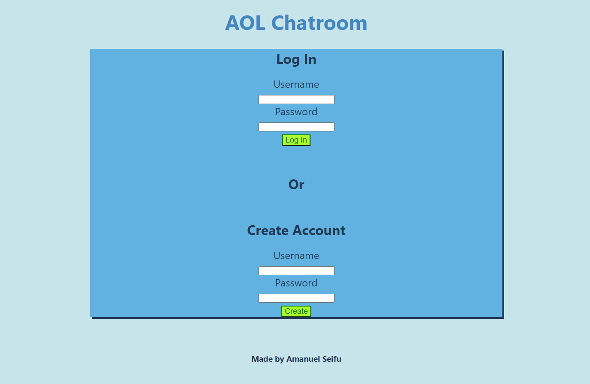
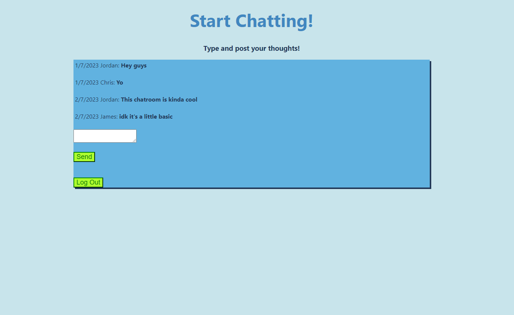

# Simple Chatroom

This project is an online chatroom made from scratch where users can make an account or log in and chat with their own unique username. This website was made with the MERN stack which includes React for the front end, Express.js for the server API, and MongoDB to store and give out account and chatroom information. Custom CSS formatting was also used for the front end. It is inspired by the simple AOL chatrooms that were popular during the early internet.

